# Scientific Computing, 2023 | Project 1: SVD-Based Digit Classification

Each MNIST handwritten digit image is a 28×28 pixel grid, represented as a 784-dimensional vector. Digit classes do not fill this high-dimensional space uniformly. They concentrate near low-dimensional subspaces, and this geometric structure governs both classification success and failure.

This project investigates the following questions:

1. How does an SVD-based projection classifier work geometrically?
2. Do different digit classes differ in intrinsic dimensionality?
3. How does subspace rank $k$ affect classification accuracy?
4. Are classification errors structured or random?
5. Can the geometry between digit subspaces predict confusion patterns?


## 1. SVD Classifier

For each digit class $i$, an orthonormal basis $U_i$ is obtained via singular value decomposition (SVD) of the training data matrix $X_i \in \mathbb{R}^{784 \times 400}$:

$$X_i = U_i \Sigma_i V_i^T$$

The classifier projects a test image $d \in \mathbb{R}^{784}$ onto the subspace spanned by the first $k$ columns of $U_i$ (denoted $U_{k,i}$):

$$\hat{d}_i = U_{k,i} U_{k,i}^T d$$

The reconstruction residual, or the distance from $d$ to class $i$'s subspace, is:

$$r_i = \left\| d - U_{k,i} U_{k,i}^T d \right\|_2$$

The test image is assigned to the class with the smallest residual:

$$\hat{y} = \arg\min_{i} \; r_i$$

Geometric Interpretation: The classifier assigns each test image to the subspace it lies closest to. A small residual indicates that the image is well approximated by that class's basis. Classification fails when two subspaces are nearly aligned.


## 2. Digit Subspaces: Structure

Decomposing the training data ($X \in \mathbb{R}^{784 \times 400}$) via SVD reveals how variance distributes across directions, with faster decay indicating lower intrinsic dimensionality. 

As shown in Figure 1 and the table below, structural complexity varies by class. Digit "1" is the simplest ($k_{90\text} = 33$), reflecting higher within-class variation. Optimal rank typically sits near this 90% variance threshold, capturing dominant structure while ignoring noise (§3.1).

<div align="center">
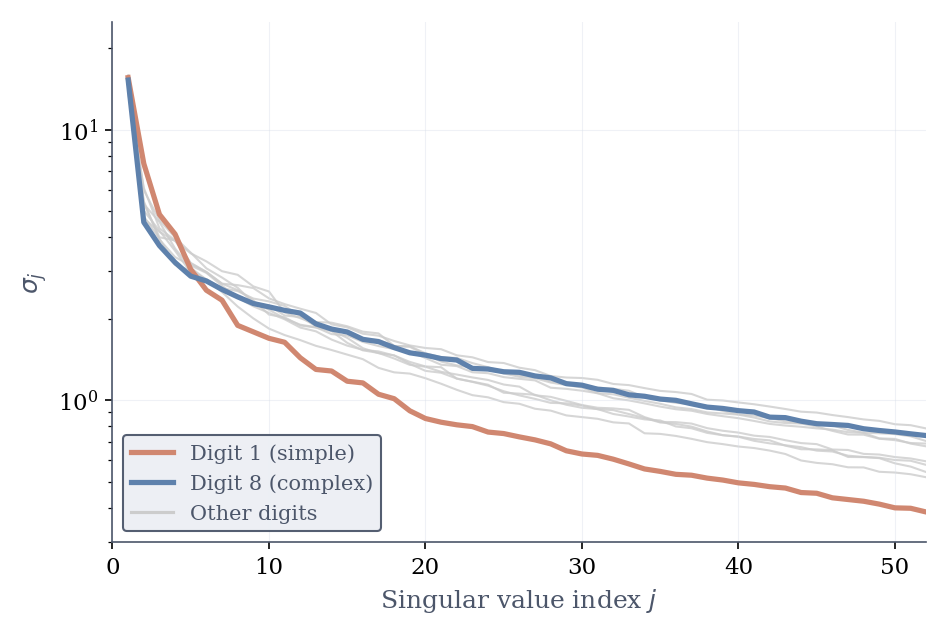

**Figure 1.** Singular value decay per digit class (log scale).
</div>

<div align="center">

| Digit | $k_{90\text}$ |       | Digit | $k_{90\text}$ |
| :---: | :--------: | :--------: | :---: | :---: | :--------: | :--------: |
|   1   |     8      |     16     |       |   3   |     25     |     46     |
|   0   |     14     |     30     |       |   4   |     26     |     49     |
|   6   |     18     |     34     |       |   2   |     27     |     47     |
|   7   |     18     |     36     |       |   8   |     28     |     51     |
|   9   |     19     |     37     |       |   5   |     33     |     57     |

</div>

The basis vectors $u_j$ (columns of $U$) provide an orthonormal basis for the class subspace. Figure 2 displays the first three components ($u_1, u_2, u_3$) per digit. Without pre-centering, $u_1$ captures the mean digit shape, while subsequent vectors represent dominant within-class variations like stroke slant and thickness.

<div align="center">
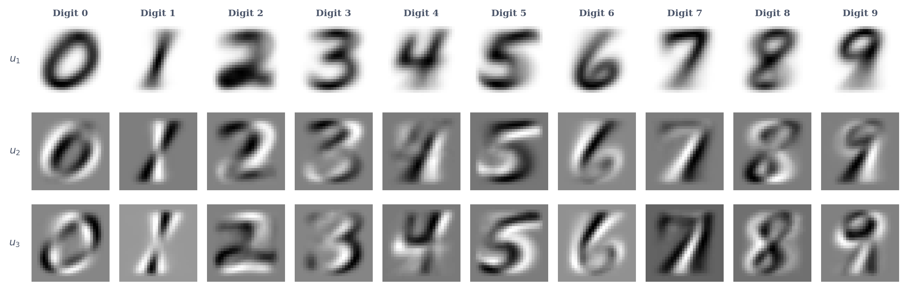

**Figure 2.** First three basis vectors $u_1, u_2, u_3$ per digit class.
</div>


## 3. Rank Selection and Subspace Stability

Subspace rank $k$ defines the number of basis vectors per class. Figure 3 evaluates testing accuracy on 10,000 images across $k \in [1, 50]$. Accuracy peaks at 95.36% ($k = 22$) before declining, as high-rank directions capture sample-specific noise rather than stable class structure (§3.1). This result is consistent with Figure 1: the discriminative signal for each digit is concentrated in its low-rank directions.

<div align="center">
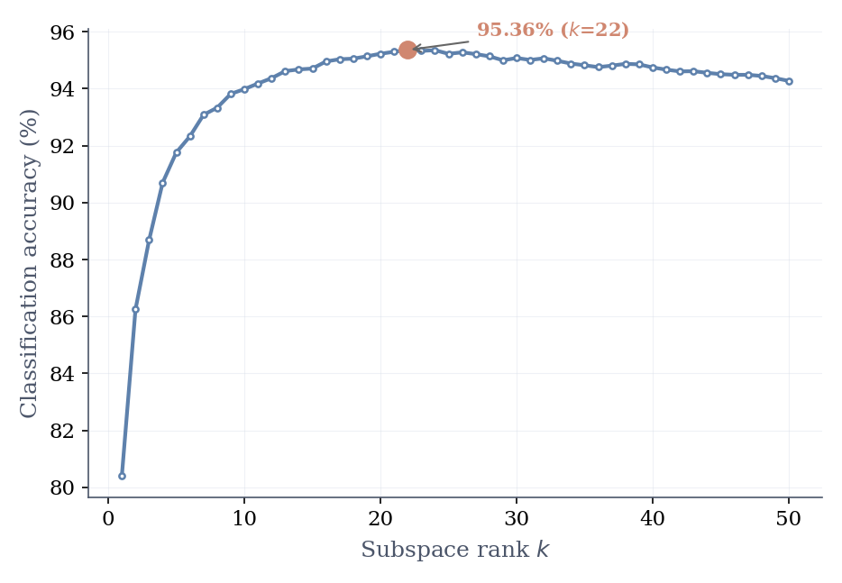

**Figure 3.** Classification accuracy vs. subspace rank $k$.
</div>

Figure 4 compares original test images with their rank-22 reconstructions ($\hat{d} = U_{22} U_{22}^T d$). The reproduction of key visual features confirms that $k = 22$ captures the dominant class structure by finding the best approximation of $d$ within the 22-dimensional subspace.

<div align="center">
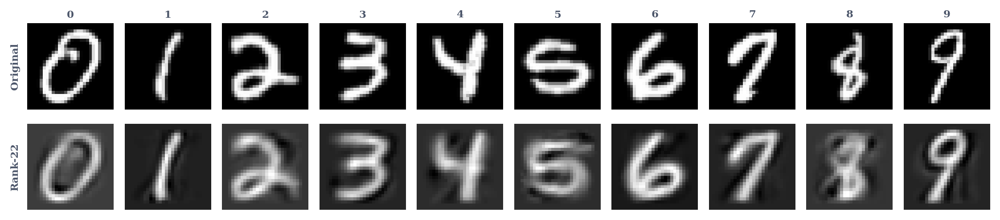

**Figure 4.** Original test images (top) and rank-22 reconstructions (bottom) for one example per digit class.
</div>


### Subspace Stability

Bootstrap resampling (10 subsets of 300 samples) confirms that low-rank directions are stable, while higher-rank components capture sample-specific noise. As shown in Figure 5, principal angles remain small for $k \leq 22$ but diverge sharply thereafter.

<div align="center">
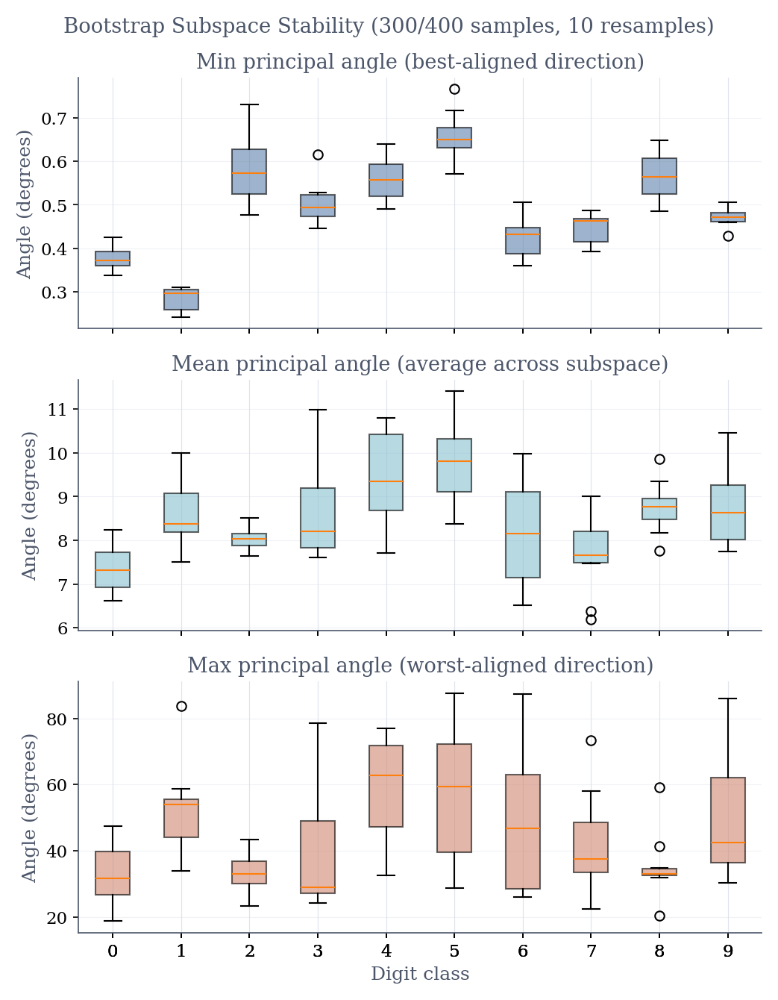

**Figure 5.** Bootstrap subspace stability: min, mean, and max principal angle between the full subspace and 10 resampled subspaces (300 of 400 samples each).
</div>

This stability threshold aligns with the singular value decay (§2), and its perfect alignment with the empirical accuracy peak (§3) further validates $k=22$ as the scientifically optimal intrinsic dimensionality.


## 4. Confusion Matrix

Figure 6 shows the normalized confusion matrix at $k = 22$. The three largest off-diagonal entries are:

* 5→3: 3.6% confusion rate
* 8→1: 2.62% confusion rate
* 7↔9: ~2.3–2.4% in both directions

<div align="center">
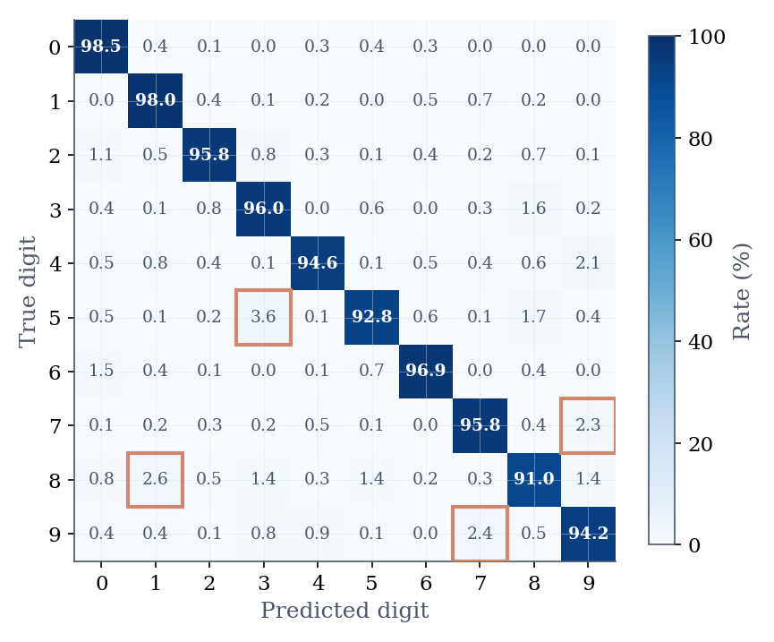

**Figure 6.** Normalized confusion matrix at $k = 22$.
</div>

Errors are structured rather than random, with specific digit pairs consistently confused. For instance, the 8→1 confusion occurs despite visual dissimilarity, suggesting a non-pixel-level geometric cause (§6).


## 5. Subspace Geometry Between Digit Classes

Principal angles $\theta$ between subspaces $U_i$ and $U_j$ quantify their alignment:

$$\theta_\ell = \arccos\bigl(\sigma_\ell(U_{k,i}^T U_{k,j})\bigr), \quad \ell = 1, \ldots, k$$

where $\sigma_\ell$ are singular values of the cross-Gram matrix. Ordered $0 \leq \theta_1 \leq \ldots \leq 90°$, a small $\theta_1$ indicates shared directions, leading to higher confusion rates.

Figure 7 shows mean principal angles between digit pairs. Pairs with small angles - (8, 1), (5, 3), (7, 9) - match the high confusion rates (8→1, 5→3, and 7↔9) shown in Figure 6.

<div align="center">
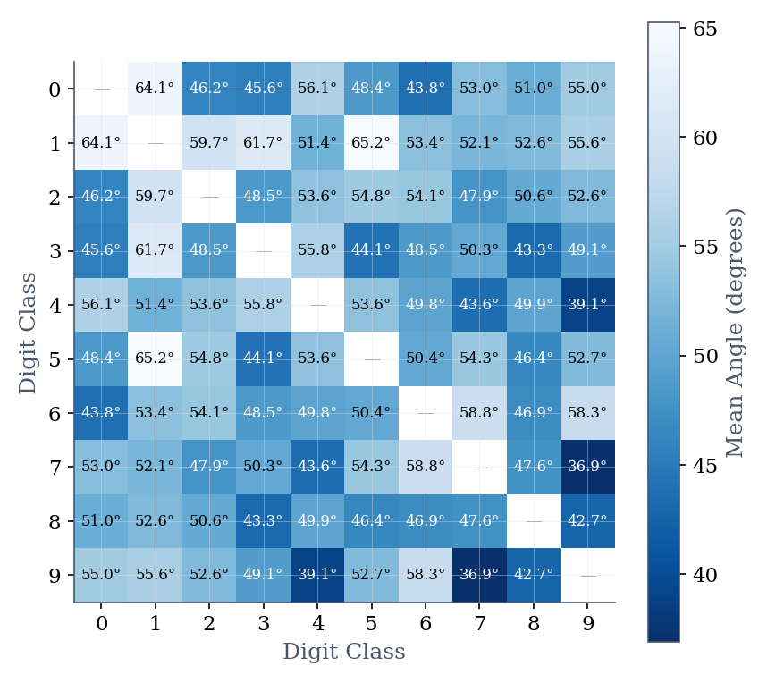

**Figure 7.** Mean principal angle (degrees) between all pairs of digit subspaces at $k = 22$.
</div>

### 5.1 Geometric Predictability of Errors

The correlation ($\rho = -0.67$) shown in Figure 8 indicates that classification errors are governed by subspace proximity. This suggests that the classifier’s failure modes are predictable from the geometric alignment of digit classes in the training data.

<div align="center">
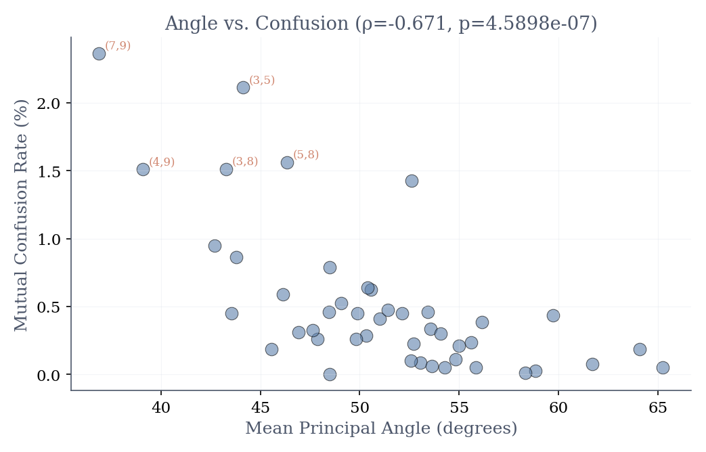

**Figure 8.** Mean principal angle vs. confusion rate for all 45 digit pairs.
</div>

### 5.2 Decoupling Structure from Pixel Similarity

To investigate whether subspace alignment merely reflects raw pixel-level similarity, I conducted a competitive regression analysis (standardized linear regression with Leave-One-Out Cross-Validation (LOO CV)) to determine whether SVD-derived overlap or simple Euclidean class-mean distance better explains the observed classification errors.

The Frobenius overlap, visualized as a heatmap in Figure 9, captures cumulative alignment across all principal directions:

$$\text{overlap}(i, j) = \left\| U_{i}^T U_{j} \right\|_F^2 = \sum_\ell \cos^2(\theta_\ell)$$

The overlap patterns in Figure 9 closely mirror the principal angle results from Figure 7, highlighting the same clusters: 8–1, 5–3, and 7–9. This consistency confirms that the similarity between these digit classes is not confined to a single aligned direction, but is a robust structural feature across the full $k=22$ subspace.

The regression yields a coefficient of determination $R^2 = 0.28$. The results reveal a clear hierarchy between the predictors: the standardized coefficient for subspace overlap (0.311) is significantly higher than that for mean image distance (-0.074). While the overall explanatory power of the model is moderate ($R^2 = 0.28$), the regression clearly indicates that subspace overlap is a substantially stronger predictor of confusion than mean image distance.

<div align="center">
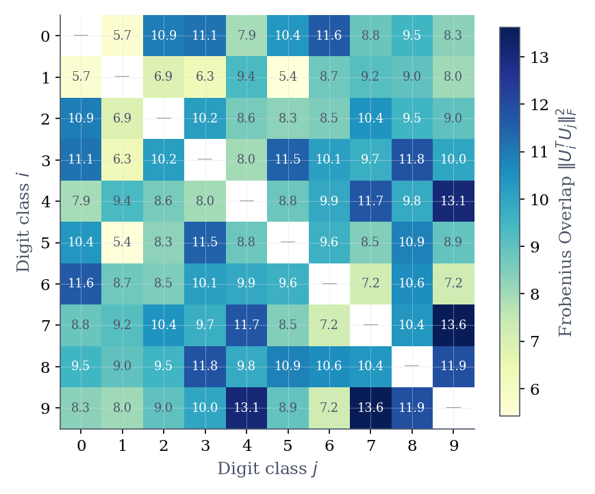

**Figure 9.** Frobenius overlap $\|U_{i}^T U_{j}\|_F^2$ between all digit pairs.
</div>

### 5.3 Principal Angle Sequences

While the mean angle and Frobenius overlap provide useful summary statistics, they do not distinguish between qualitatively different alignment profiles. To understand the specific nature of subspace proximity, I examined the full spectrum of principal angles $(\theta_1, \ldots, \theta_{22})$ for representative digit pairs. The distribution of principal angles indicates how many effective dimensions two digit subspaces approximately share: a single small angle suggests a low-dimensional intersection, whereas many small angles indicate broad structural similarity across multiple modes of variation. Thus, the angle spectrum can be interpreted as an estimate of the effective intersection dimensionality between digit subspaces.

Figure 10 shows that digit pairs with similar confusion rates can nevertheless exhibit very different principal angle spectra, indicating qualitatively different types of subspace alignment. The 8–1 pair has a minimum angle of 6.21°: the two subspaces share one nearly aligned direction but diverge quickly at higher indices. This indicates a single shared structural direction rather than broad overlap. In contrast, the 5–3 pair maintains small angles across many dimensions, reflecting broad structural similarity throughout the subspace. Despite the 8–1 and 5–3 pairs having similar minimum principal angles, the 5–3 confusion rate (3.6%) is higher than that of 8–1 (2.62%). This is precisely because a broad, multi-dimensional subspace overlap is much harder for the classifier to distinguish than a single-dimensional alignment. The 0–6 pair serves as a reference with a standard angle sequence.

<div align="center">
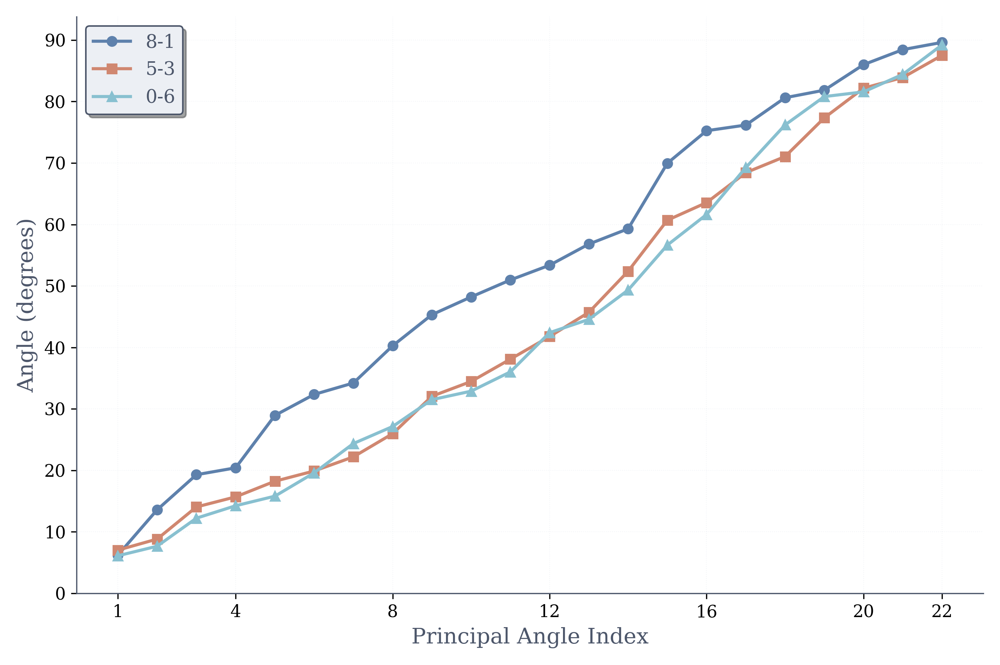

**Figure 10.** Principal angle sequences for key digit pairs ($k = 22$).
</div>

## 6. Centered SVD (PCA): Decoupling Mean from Variation

In the baseline classifier (§1), I computed the SVD directly on the raw image matrix. The resulting subspace $U_i$ captures the dominant directions of the data, which inherently includes the class mean. To isolate the unique structural variations of each digit, I implemented Centered SVD, which is equivalent to Principal Component Analysis (PCA). By subtracting the class mean $\mu_i$ before performing SVD, the resulting subspace $U_i^{PCA}$ represents only the within-class variation, effectively decoupling the static "average" shape from the dynamic variations. The two methods are compared at their respective optimal ranks.

Figure 11 shows that PCA reaches 95.67% accuracy at $k = 23$, an improvement of 0.31 percentage points over the uncentered SVD baseline.

<div align="center">
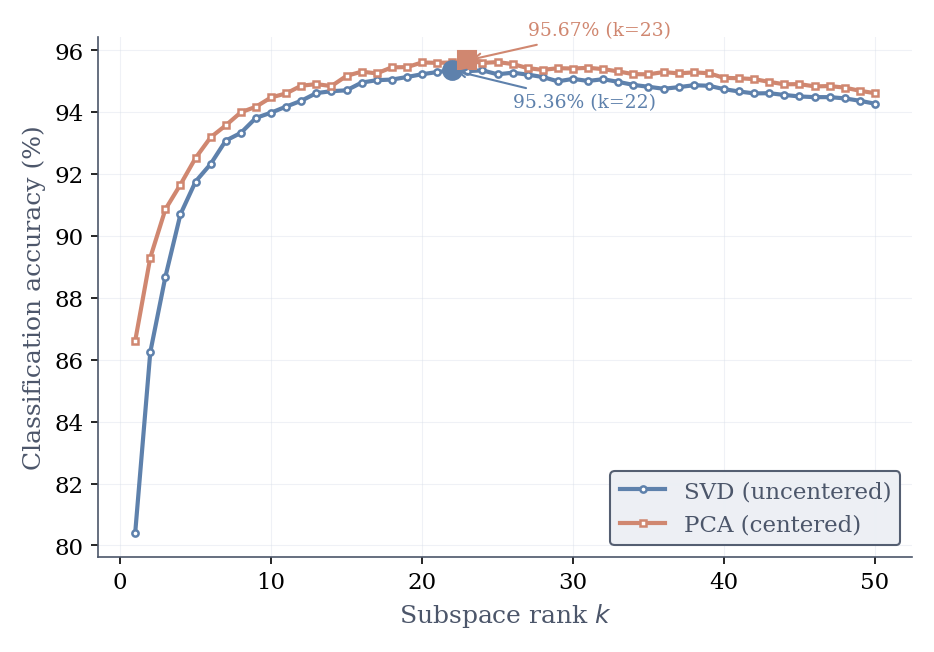

**Figure 11.** Accuracy vs. rank $k$ for uncentered SVD and centered SVD (PCA).
</div>

Figure 12 shows the confusion matrices side by side: the 8→1 confusion rate drops from 2.62% to 1.93% after centering, consistent with the hypothesis that part of the confusion is driven by shared mean image shape.

<div align="center">
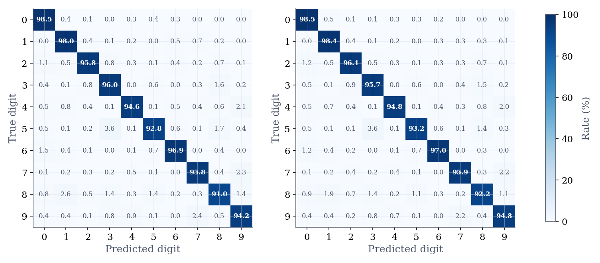

**Figure 12.** Confusion matrices for uncentered SVD (left) and centered SVD / PCA (right) at their respective optimal ranks.
</div>

Furthermore, centering increases the minimum principal angle for the 8–1 pair from 6.21° to 13.78°, effectively pulling the two subspaces apart by removing the shared mean component. This confirms that much of the initial confusion was due to the shared static baseline of the digit shapes rather than their unique structural variations. While 13.78° remains the smallest minimum angle among all 45 digit pairs after centering, the reduction in overlap qualitatively demonstrates that PCA provides more robust separation of digit classes by isolating unique structural features.


## 7. Conclusion

This project demonstrates that an SVD-based projection classifier is highly effective for MNIST, achieving up to 95.67% accuracy through PCA. Returning to the questions proposed before:

1. **How does an SVD-based projection classifier work geometrically?**
   
   *It classifies test images by projecting them onto class-specific low-dimensional subspaces and finding the minimum reconstruction residual. Its success depends entirely on whether digit classes occupy distinct, non-overlapping geometric regions.*

2. **Do different digit classes differ in intrinsic dimensionality?**
   
   *Yes. Simple, structurally consistent digits (like "1") saturate their variance around $k \approx 10$, while geometrically complex digits with higher within-class variation (like "5" and "8") require $k \geq 20$.*

3. **How does subspace rank $k$ affect classification accuracy?**
   
   *Accuracy is strictly stability-limited, peaking at $k=22$. Below this, the model underfits core structural modes. Above $k=22$, subspace directions overfit to sample-specific noise rather than universal class templates, causing sharp performance degradation.*

4. **Are classification errors structured or random?**
   
   *Errors are highly structured. Specific pairs like 5→3 and 8→1 dominate the failure cases, revealing that misclassifications stem from inherent geometric proximity rather than random pixel-level noise.*

5. **Can the geometry between digit subspaces predict confusion patterns?**
   
   *Yes. Confusion rates correlate strongly ($\rho = -0.67$) with small principal angles between subspaces. Furthermore, decoupling the structural variations via PCA (Centered SVD) proves that removing shared "mean shapes" aggressively separates heavily confused pairs (e.g., increasing the 8–1 minimum angle from 6.21° to 13.78°).*


## Quick Start

### 1. Environment Setup

Create and activate a new Conda environment (`python=3.10` recommended):

```bash
conda create -n mnist-svd python=3.10
conda activate mnist-svd
```

Install the project in editable mode (this automatically installs all dependencies from `pyproject.toml`):

```bash
pip install -e .
```

### 2. Prepare Data

Download the MNIST data and save the arrays to the `data/` directory:

```text
data/TrainDigits.npy   # shape (784, 60000)
data/TrainLabels.npy   # shape (60000,)
data/TestDigits.npy    # shape (784, 10000)
data/TestLabels.npy    # shape (10000,)
```

### 3. Run Analysis

Execute the scripts in order. All generated visualizations will be saved to the `figures/` directory.

```bash
python src/data_preparation.py   # L2-normalize images
python src/svd_basis.py          # singular values, basis images, reconstruction
python src/classifier.py         # accuracy vs rank, confusion matrix
python src/principal_angles.py   # subspace overlap, stability
python src/angle_sequences.py    # principal angle heatmap, correlation, sequences
python src/centered_svd.py       # PCA comparison
```
