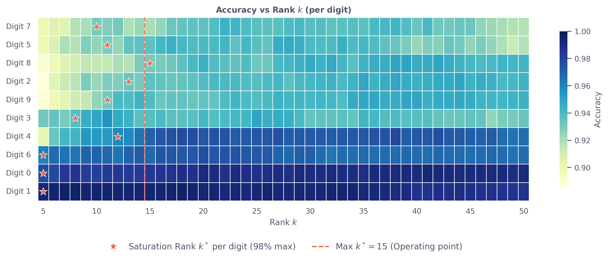
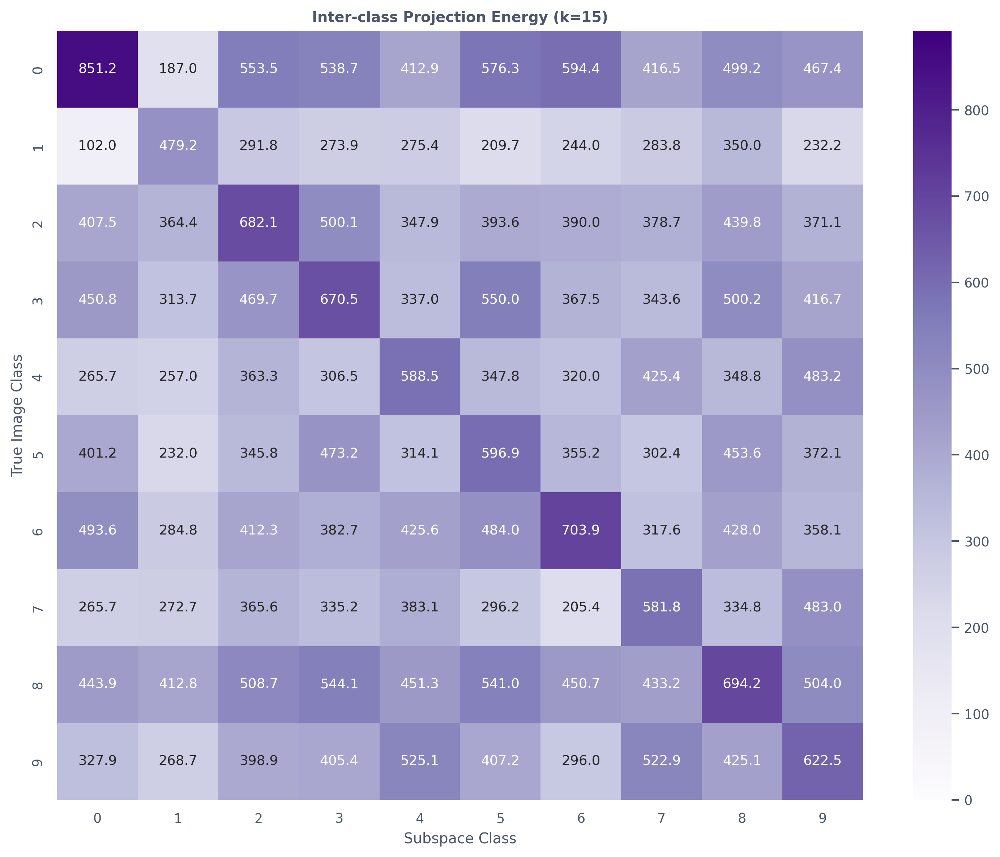
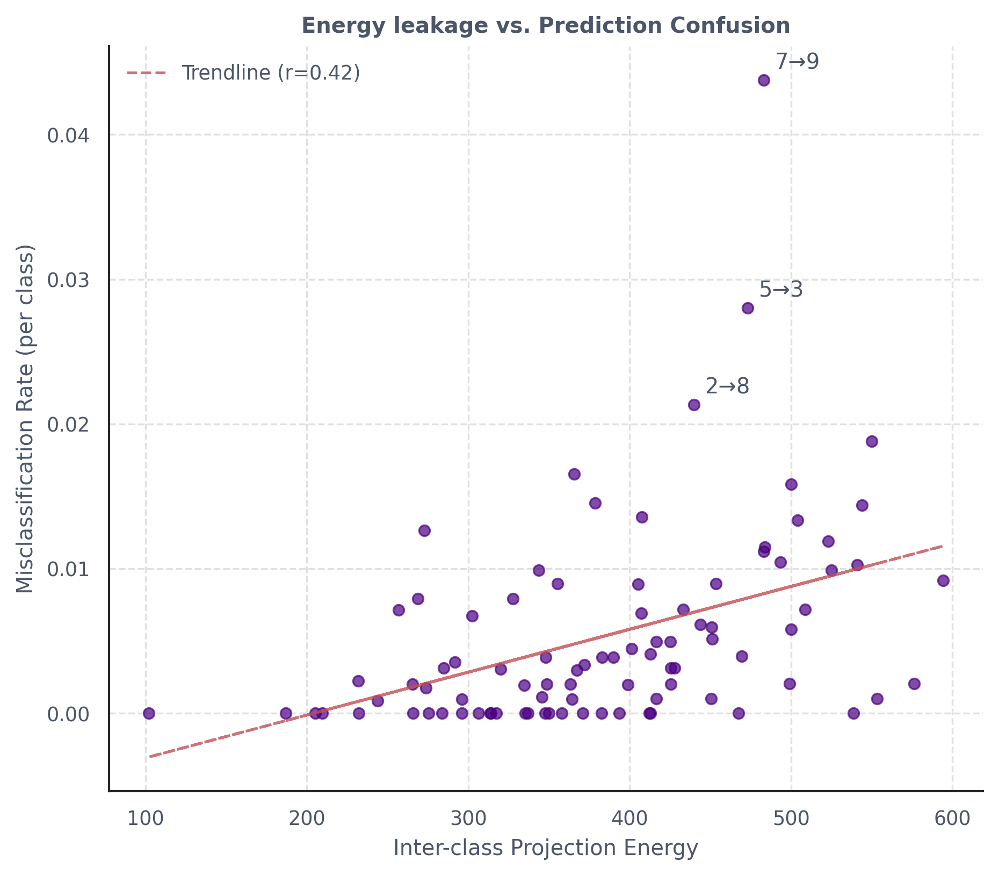
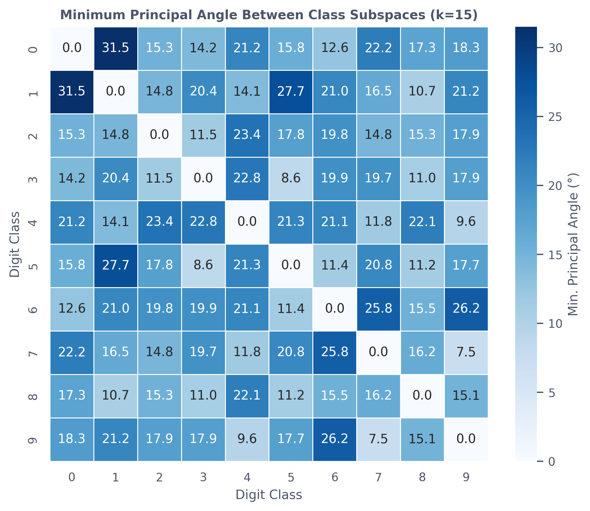
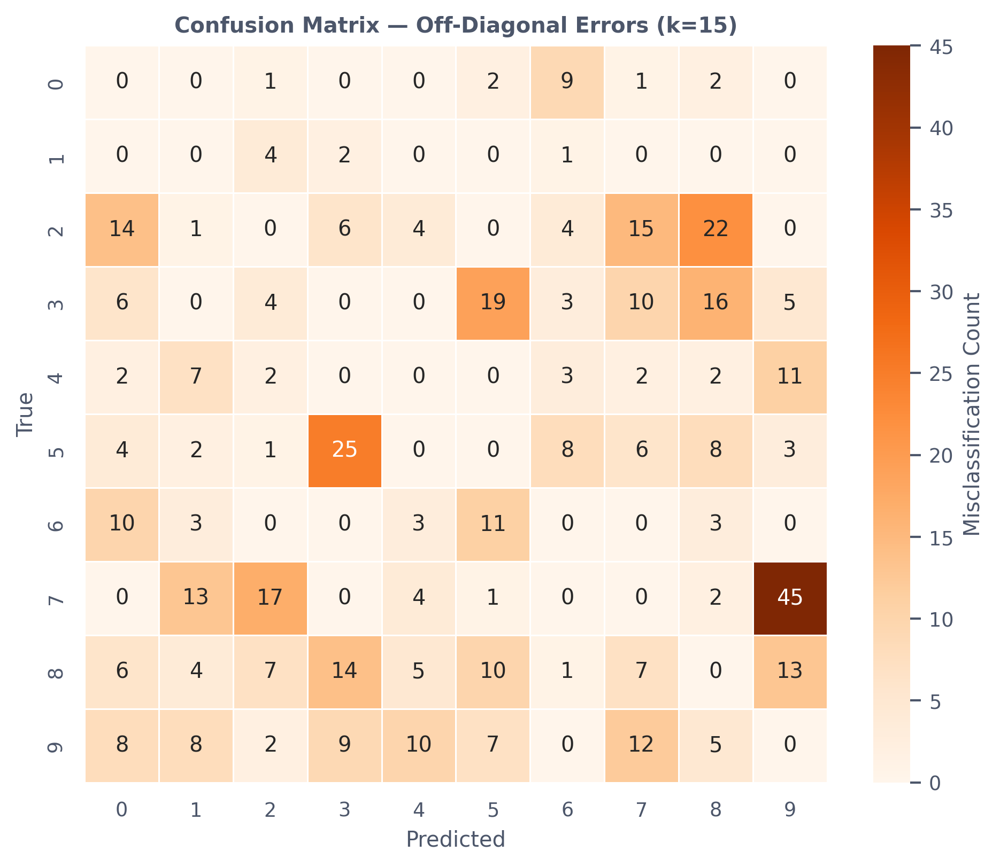
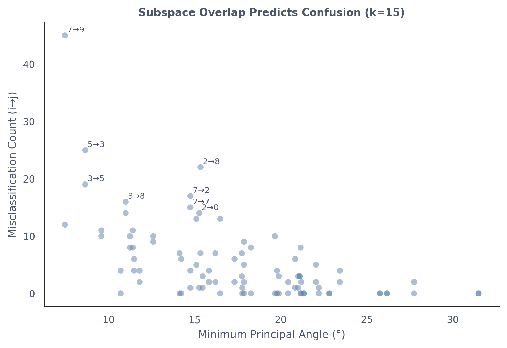
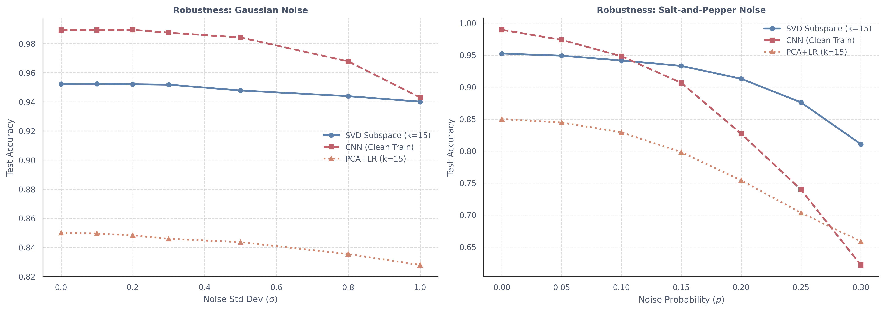

# Geometric Analysis of SVD Subspace Classifiers on MNIST

## Summary

SVD subspace classifiers give a surprisingly strong linear baseline on MNIST. For each digit class we fit a single matrix decomposition (no gradient descent, and the only knob is the rank $k$), and already reach 95.2% test accuracy at $k=15$. The main question in this project is simple: for such a bare-bones linear model, where do the errors actually come from, and can we predict them from geometry alone?

In short, we find two things. First, class subspaces are not mutually orthogonal; pairs with small principal angles exhibit strong “energy crosstalk”, and those are precisely the pairs that carry most of the confusion mass. Second, the same low-rank projection that throws away useful information (and caps accuracy) also discards most ambient noise, which makes the SVD classifier unexpectedly robust to both Gaussian and salt-and-pepper noise compared to a CNN trained only on clean data.

---

## Setup

### Data
Standard MNIST images ($28 \times 28$) are flattened to vectors $x \in \mathbb{R}^{784}$ and normalized by subtracting the dataset mean and dividing by the standard deviation.

### SVD Subspace Classifier
For each class $i$, training images are stacked into a matrix $X_i$. The rank-$k$ SVD provides an orthonormal basis $U_{i,k}$ for the class subspace. A test image $x$ is assigned to the class whose subspace captures the most energy:
$$ \hat{y} = \arg\max_i \| U_{i,k}^\top x \|_2^2 $$

At $k=15$ this yields **95.2% test accuracy**, compared to 85.0% for global PCA + Logistic Regression using the same 15 components — a gap attributable to class-discriminative structure: class-specific subspaces capture within-class variation, while global PCA conflates variation across all digits. We use $k=15$ as the operating point throughout: it is the maximum saturation rank $k^*$ across all digit classes (Section 1), so all classes have reached near-peak accuracy by this rank.

---

## Results

### 1. Accuracy Curve and Saturation Rank

We define the **saturation rank** $k^*$ as the minimum rank required to achieve 98% of a class's peak accuracy. Digits saturate at distinct ranks ($k^* \in [5, 15]$), reflecting their differing intra-class linear variance: digit 1 (narrow, upright strokes) concentrates energy in very few directions, while digit 8 (two loops, high stroke variability) requires more dimensions. The subspace needs to be discriminative, not complete.

<div align="center">

</div>

### 2. Energy Leakage Predicts Confusion

Intuitively, a test image from class $i$ should put most of its projection energy into the subspace for class $i$. If it also lands with high energy in class $j$’s subspace, the classifier is at risk of predicting $j$ instead. We call this from $i$ to $j$ **energy leakage**: the mean projection energy of class $i$ images onto subspace $j$.

At $k=15$ we compute the full $10 \times 10$ leakage matrix over all ordered class pairs $(i,j)$, and compare its off-diagonal entries with the empirical confusion matrix. On those off-diagonal entries, the Pearson correlation between leakage and misclassification rate is about $r = 0.42$ ($p < 10^{-4}$). This is not a perfect fit, but it is strong enough to say that pairs that leak more energy tend to be confused more often. If we normalize the confusion matrix row-wise to per-class error rates and recompute the correlation, $r$ barely changes, which suggests the effect is not simply driven by class-size imbalance.

<div align="center">


</div>

### 3. Subspace Geometry is the Root Cause

From a linear algebra perspective, leakage happens because the subspaces are geometrically too close. For a pair of classes $(i,j)$ we can compute the minimum principal angle $\theta_{\min}(i,j)$ between their rank‑$k$ subspaces; in theory, cross-projection energy should scale like $\cos^2(\theta_{\min})$. Empirically, this is roughly what we see: over all off-diagonal pairs, $\cos^2(\theta_{\min})$ and the measured leakage have a correlation of about $r = 0.71$ ($p < 10^{-14}$), which is noticeably stronger than the leakage–error correlation in the previous section.

This puts **subspace angle one step further upstream in the causal story**: small angle → larger leakage → higher error. Concretely, pairs with very small $\theta_{\min}$ (e.g., 7–9 at about $7.5^\circ$) tend to have large off-diagonal counts in the confusion matrix, while pairs with large angles (e.g., 0–1 at about $31.5^\circ$) are rarely mistaken for one another.

One subtlety is directionality. The angle $\theta_{\min}(i,j) = \theta_{\min}(j,i)$ is symmetric, but in the confusion matrix 7→9 errors are much more frequent than 9→7. The angle alone cannot explain this. We therefore look at the shared principal direction between the two subspaces and measure the variance of each class along it. Class 7 turns out to have substantially larger variance along that direction (about $1.4\times$ that of class 9), which means its cloud extends further in the shared direction and more samples cross into class 9’s subspace—hence more 7→9 errors than 9→7.

<div align="center">



</div>

### 4. Low-Rank Projection and Noise Stability

The previous sections focus on why a low-rank subspace model makes mistakes. The effect on noise is almost the opposite: with $k = 15 \ll 784$, the projection keeps only about $2\%$ of the ambient dimensions and discards the rest. If noise is roughly isotropic in the 784‑dimensional space, most of its energy lives in the discarded directions.

In the robustness experiments we compare three classifiers: the SVD subspace model ($k=15$), a global PCA+LR baseline with the same 15 dimensions, and a CNN trained on clean MNIST to about 99.0% accuracy. Under Gaussian noise (e.g., $\sigma = 1.0$), SVD drops from 95.2% to around 94.0%, PCA+LR from 85.0% to about 82.8%, and the CNN from 99.0% to about 94.6%. The SVD and PCA+LR curves track each other closely, which is consistent with the idea that low-rank projection itself explains most of the Gaussian robustness, regardless of whether the subspace is class-specific or global.

Salt-and-pepper noise is more local and extreme. Here the SVD decision amounts to comparing global inner products in 784 dimensions: each pixel contributes roughly $1/784$ to the total score, so individual outliers are averaged out. CNNs, with local receptive fields, are more sensitive to such isolated corruptions. In our setup, when the corruption probability reaches $p = 0.30$, the SVD classifier still achieves about 81.1% accuracy, while the CNN has dropped to roughly 65.8% and PCA+LR to about 66.6%.

The CNN in these experiments is trained only on clean data; with targeted noise augmentation its robustness curve would likely move upward and close some of the gap. The point here is narrower: even without any clever training tricks, a simple low-rank linear model comes with a built-in noise filter.

<div align="center">

</div>

---

## Conclusion

On MNIST, SVD subspace classifiers provide a strong linear baseline, and their behavior is far from a black box. We see that:

- errors concentrate on pairs of digits whose subspaces have small principal angles and hence large energy leakage;
- angles, leakage, and confusion fit together into a fairly direct geometric story: subspace geometry → energy distribution → error patterns;
- the same low-rank structure that creates “blind spots” by discarding fine detail also acts as a strong noise filter.

In the salt‑and‑pepper experiments, the SVD and CNN curves cross around $p \approx 0.08$, and by $p = 0.30$ the SVD model leads by roughly 15 percentage points. This does not mean that “a linear model beats a CNN” in any broad sense. Rather, it is a reminder that the geometry of a model—what subspace it keeps and what it throws away—already imposes strong constraints on its behavior, and many seemingly complicated effects can be traced back to that geometry.

---

## Reproduce

```bash
conda create -n mnist-svd python=3.10 && conda activate mnist-svd
pip install -e .

python experiments/01_accuracy_curve.py
python experiments/02_leakage_correlation.py
python experiments/03_subspace_geometry.py
python experiments/04_robustness_benchmark.py
```
